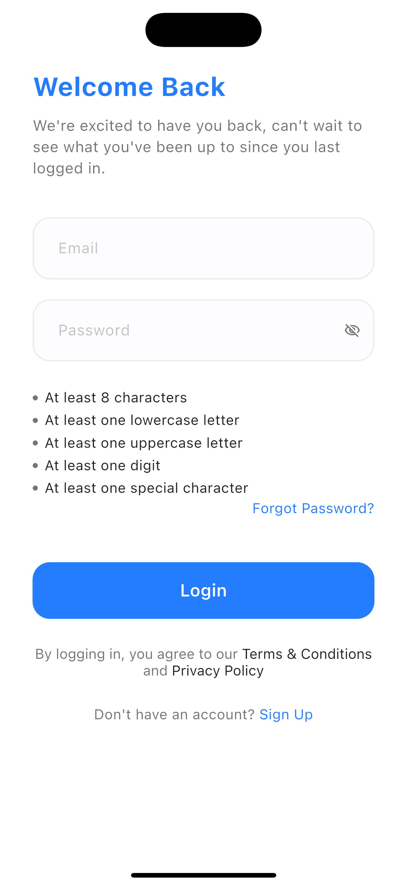
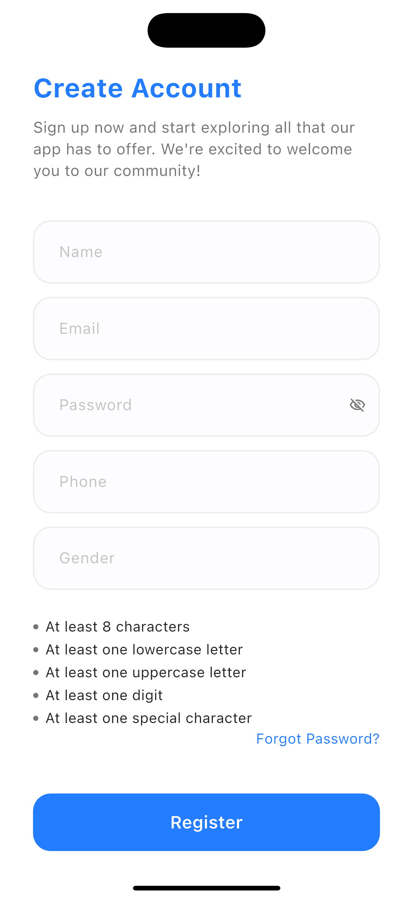
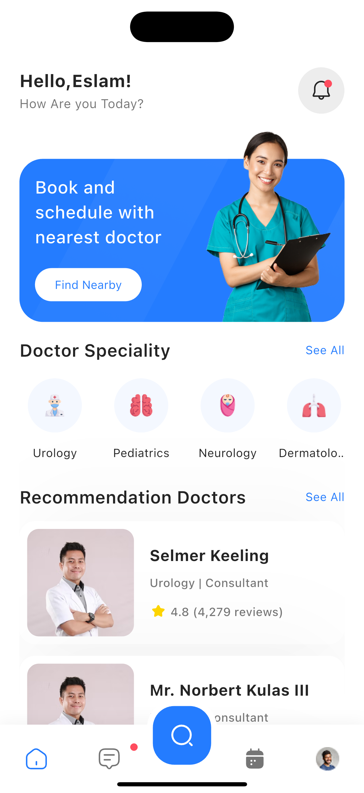
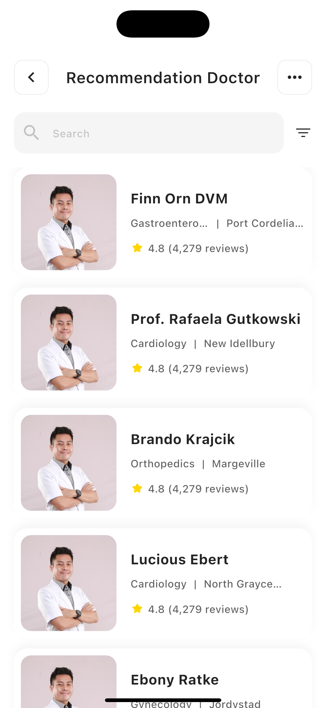
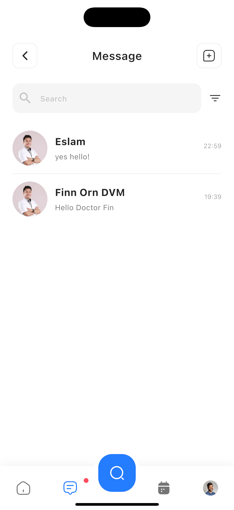

# DocDoc — Medical Appointment Booking App

A production-ready Flutter medical app that connects patients with doctors across multiple specializations. Patients can browse specializations, search and filter doctors, view detailed profiles, book appointments with real-time slot selection, and communicate with doctors through a real-time chat inbox powered by Firebase Firestore.

Built with **Clean Architecture**, **BLoC/Cubit** state management, **Retrofit + Dio** networking, and **GetIt** dependency injection.

---

## Screenshots

<table>
  <tr>
    <td align="center"><br/><b>Onboarding</b></td>
    <td align="center"><br/><b>Login</b></td>
    <td align="center"><br/><b>Register</b></td>
  </tr>
  <tr>
    <td align="center"><br/><b>Home</b></td>
    <td align="center"><br/><b>Specializations</b></td>
    <td align="center"><br/><b>Doctors List</b></td>
  </tr>
  <tr>
    <td align="center"><br/><b>Doctor Details</b></td>
    <td align="center"><br/><b>Book Appointment</b></td>
    <td align="center"><br/><b>Nearby Doctors</b></td>
  </tr>
  <tr>
    <td align="center"><br/><b>Inbox</b></td>
    <td align="center"><br/><b>Chat Thread</b></td>
    <td align="center"><br/><b>Notifications</b></td>
  </tr>
</table>

> Add your screenshots to a `screenshots/` folder at the project root before publishing.

---

## Key Features

- **Authentication** — Login & registration with JWT-based auth, secure token storage via `flutter_secure_storage`, and persistent login state
- **Doctor Browsing** — Browse 15+ medical specializations (Cardiology, Dentistry, Neurology, Pediatrics, etc.) with specialty-specific doctor listings
- **Doctor Search & Sort** — Search doctors by name with debounced input, sort by name (A-Z / Z-A) or specialization via a reusable bottom sheet
- **Doctor Details** — Detailed profiles showing qualifications, contact info, availability windows, and patient reviews with star ratings
- **Appointment Booking** — Time-slot picker generated from each doctor's working hours, with booking confirmation flow
- **Nearby Doctors** — Location-aware listing of doctors near the patient with map integration
- **Real-Time Inbox** — Firebase Firestore-powered messaging with live conversation streams, unread indicators, and last-message previews
- **Chat Thread** — Full conversation UI with sent/received message bubbles, session tags, and a rich input bar (attachments, camera, emoji)
- **New Message** — Doctor suggestion sheet with search/sort to start new conversations
- **Notifications** — In-app notification center for appointment updates and system alerts
- **Multi-Flavor Builds** — Separate development and production entry points with independent configurations
- **Responsive UI** — Fully responsive layouts using `flutter_screenutil` for consistent sizing across devices

---

## Tech Stack

| Concern | Technology |
|---|---|
| Framework | Flutter / Dart 3.x |
| State Management | flutter_bloc / Cubit |
| Networking | Retrofit + Dio |
| Dependency Injection | GetIt |
| Code Generation | Freezed, json_serializable, retrofit_generator |
| Real-Time Database | Cloud Firestore (Firebase) |
| Secure Storage | flutter_secure_storage |
| Local Storage | shared_preferences |
| JWT Decoding | jwt_decoder |
| Image Caching | cached_network_image |
| SVG Rendering | flutter_svg |
| Loading Skeletons | shimmer |
| Responsive Sizing | flutter_screenutil |
| Localization | easy_localization + intl |
| Splash Screen | flutter_native_splash |
| HTTP Logging | pretty_dio_logger |

---

## Architecture

The app follows a **feature-first architecture** with clear separation between data, business logic, and presentation layers.

### System Design


### Layer Overview

```
┌─────────────────────────────────────────────────┐
│                 Presentation                     │
│         Screens  ←→  Cubits  ←→  States          │
│        (Widgets)    (BLoC)     (Freezed)         │
├─────────────────────────────────────────────────┤
│                   Domain                         │
│              Repositories (contracts)            │
├─────────────────────────────────────────────────┤
│                    Data                          │
│   API Services (Retrofit)  │  Firebase Services  │
│   Models (json_serializable) │ Error Handling    │
├─────────────────────────────────────────────────┤
│                    Core                          │
│  DI (GetIt)  │ Routing │ Theming │ Networking    │
└─────────────────────────────────────────────────┘
```

### Project Structure

```
lib/
├── core/
│   ├── di/                  # GetIt DI container — setupDI()
│   ├── helpers/             # AppPreferences, Constants, CurrentUser, extensions
│   ├── models/              # Shared models (DoctorModel)
│   ├── networkingv2/        # DioFactory, ApiService, ApiResult<T>, ErrorHandler
│   ├── routing/             # AppRouter (switch on Routes.*), route constants
│   ├── theming/             # ColorsManager, TextStyles, FontWeightHelper
│   ├── localization/        # i18n configuration
│   └── widgets/             # Shared UI components (SearchBar, TextButton, TextFormField)
│
└── features/
    ├── auth/
    │   ├── login/           # Login screen with JWT auth
    │   ├── register/        # Registration with form validation
    │   └── onboarding/      # App introduction slides
    │
    ├── home/                # Multi-screen feature
    │   ├── data/            # Shared: HomeApiService, repos, models
    │   └── ui/
    │       ├── home/        # Dashboard with specializations grid + top doctors
    │       ├── specializations/  # Full specialization listing
    │       ├── doctors/     # Filterable doctor list with search & sort
    │       ├── doctor_details/   # Doctor profile with reviews
    │       ├── book_appointment/ # Time-slot picker + booking confirmation
    │       ├── nearby_doctors/   # Location-based doctor discovery
    │       └── notifications/    # Notification center
    │
    ├── inbox/               # Multi-screen feature (Firebase)
    │   ├── data/            # Firestore services, repos, conversation/message models
    │   └── ui/
    │       ├── inbox/       # Conversation list with real-time updates
    │       ├── new_message/  # Doctor suggestion sheet for new conversations
    │       └── chat_thread/  # Full chat UI with message bubbles
    │
    └── main/                # Bottom navigation shell (IndexedStack)
        └── ui/
            ├── logic/       # MainCubit — tab selection state
            ├── widgets/     # BottomNavBar, PlaceholderScreen
            └── main_page.dart
```

### Feature Conventions

| Pattern | Rule |
|---|---|
| **Single-screen feature** | `data/` + `ui/logic/` + `ui/widgets/` + `ui/<name>_screen.dart` |
| **Multi-screen feature** | Shared `data/` at feature root, each screen in its own `ui/` subfolder |
| **State management** | One Cubit per screen that independently calls an API |
| **Cubit states** | Freezed sealed unions: `initial \| loading \| success(T) \| error(ApiErrorModel)` |
| **DI registration** | Repos as `registerLazySingleton`, Cubits as `registerFactory` |
| **Routing** | `AppRouter.generateRoute` switch on `Routes.*` string constants |

---

## State Management

Every screen that fetches data has its own **Cubit** with Freezed-generated sealed state unions:

```dart
@freezed
class DoctorsState with _$DoctorsState {
  const factory DoctorsState.initial() = _Initial;
  const factory DoctorsState.loading() = Loading;
  const factory DoctorsState.success(List<DoctorModel> doctors) = Success;
  const factory DoctorsState.error(ApiErrorModel error) = Error;
}
```

State is consumed via `BlocBuilder` / `BlocSelector` scoped to only the subtree that needs rebuilding — static UI elements (navbars, search bars) sit outside the builder to avoid unnecessary rebuilds.

---

## API & Data Layer

- **REST API** — Backed by the `vcare` API (`https://vcare.integration25.com/api/`) using Retrofit-generated type-safe HTTP clients
- **Firebase Firestore** — Real-time messaging with `snapshots()` streams for live conversation updates
- **Error Handling** — Unified `ApiResult<T>` Freezed union (`Success | Failure`) wrapping all API calls, with `ErrorHandler` converting Dio exceptions into structured `ApiErrorModel`
- **JWT Auth** — Token stored in `flutter_secure_storage`, injected into Dio headers via `DioFactory.setTokenIntoHeadersAfterLogin()`

---

## Security Practices

- Auth tokens stored in **encrypted secure storage** (`flutter_secure_storage`), never in plain SharedPreferences
- JWT decoded client-side only for user identification (`jwt_decoder`), never for authorization decisions
- API requests authenticated via Bearer token injected at the Dio interceptor level
- Sensitive vs. non-sensitive data separated: `flutter_secure_storage` for tokens, `shared_preferences` for UI preferences only

---

## Performance Optimizations

- **`RepaintBoundary`** on repeated list items — each card's shadow/decoration is rasterized independently
- **`BlocSelector`** scoping — only the subtree that depends on state rebuilds; static chrome (navbars, search bars) stays outside
- **`ListView.builder`** / `.separated` for all dynamic lists — never `ListView(children: [...])` which builds every item upfront
- **`memCacheWidth` / `memCacheHeight`** on cached images — prevents decoding full-resolution bitmaps into small display boxes
- **`const` constructors** everywhere possible — lets Flutter skip rebuilding unchanged subtrees entirely
- **Debounced search input** — API calls fire only after the user stops typing, not on every keystroke
- **`IndexedStack`** for bottom navigation — preserves page state across tab switches without rebuilding

---

## Getting Started

### Prerequisites

- Flutter SDK `^3.11.1`
- Dart `^3.11.1`
- Firebase project configured (Firestore enabled)
- iOS: CocoaPods installed
- Android: Android SDK with minimum API level configured

### Installation

```bash
# 1. Clone the repository
git clone https://github.com/your-username/doc-doc.git
cd doc-doc

# 2. Install dependencies
flutter pub get

# 3. Generate code (Freezed, Retrofit, json_serializable)
dart run build_runner build --delete-conflicting-outputs

# 4. Run the app (development flavor)
flutter run -t lib/main_development.dart

# 5. Run the app (production flavor)
flutter run -t lib/main_production.dart
```

### Other Commands

```bash
# Watch and regenerate on file changes
dart run build_runner watch --delete-conflicting-outputs

# Static analysis
flutter analyze

# Run tests
flutter test
```

---

## Engineering Highlights

### Strengths

- **Dual data source architecture** — REST API for medical data + Firebase Firestore for real-time messaging, cleanly separated through the repository pattern
- **Reusable component design** — Search bar and sort sheet widgets are decoupled from any specific Cubit, accepting callbacks so they work across Doctors, New Message, and Inbox screens
- **Type-safe networking** — Retrofit generates HTTP clients from annotations; Freezed generates sealed unions for state — zero hand-written boilerplate for API calls or state transitions
- **Performance-first list rendering** — `RepaintBoundary`, `BlocSelector` scoping, `memCacheWidth`, and `ListView.builder` applied consistently across all data-heavy screens

### Challenges Solved

- **Cubit context scoping** — Resolved `BlocProvider` lookup failures in modal bottom sheets by extracting child widgets to ensure the correct `BuildContext` is used for provider lookup
- **Reusable sort/filter architecture** — Refactored tightly-coupled sort sheet from single-Cubit dependency to a callback-based pattern, enabling reuse across three different screens without code duplication
- **Dual API format error handling** — Server returns errors in two formats (`{ message, code, data }` and plain string); `ErrorHandler` normalizes both into a single `ApiErrorModel`

### Known Trade-offs

- Chat messages are currently static sample data — Firestore message read/write is wired at the conversation level but not yet at the individual message level
- Three bottom navigation tabs (Search, Appointments, Profile) are placeholder screens pending implementation
- Test coverage is minimal — architecture supports testing through DI and repository abstraction, but unit/widget tests are not yet written

---

## Contact

**Eslam Madhoun**

- Email: alimadhounvipsa@gmail.com
- GitHub: [github.com/your-username](https://github.com/your-username)

---

## License

This project is licensed under the MIT License — see the [LICENSE](LICENSE) file for details.
